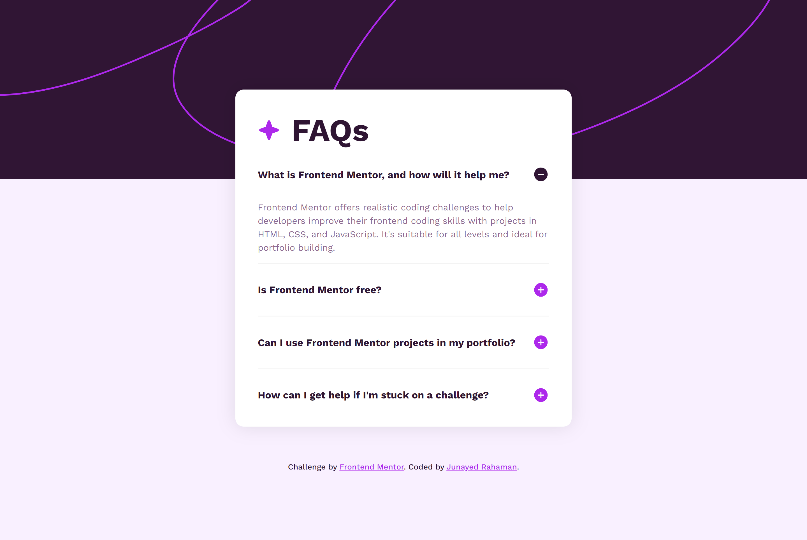

# Frontend Mentor - FAQ accordion solution

This is a solution to the [FAQ accordion challenge on Frontend Mentor](https://www.frontendmentor.io/challenges/faq-accordion-wyfFdeBwBz). Frontend Mentor challenges help you improve your coding skills by building realistic projects.

## Table of contents

- [The challenge](#the-challenge)
- [Screenshot](#screenshot)
- [Links](#links)
- [My process](#my-process)
- [Built with](#built-with)
- [Author](#author)

### The challenge

Users should be able to:

- Hide/Show the answer to a question when the question is clicked
- Navigate the questions and hide/show answers using keyboard navigation alone
- View the optimal layout for the interface depending on their device's screen size
- See hover and focus states for all interactive elements on the page

### Screenshot

This is the desktop version of the component. I didn't upload the mobile version cause it's too long.

### Links

- Live Site URL: [Live site of the challenge hosted here](https://faq-accordion7.netlify.app/)

## My process

I have built the layout using flexbox. The Hide/Show effect of answers on clicking questions is implemented using necessary css classes. I have used jQuery to add sliding animation and click events. The classes are toggled using jQuery. Added media queries to make the component responsive.

### Built with

- Semantic HTML5 markup
- CSS custom properties
- Flexbox
- jQuery

## Author

- Website - [Junayed Rahaman](https://webpixels.netlify.app/)
- Frontend Mentor - [@junayedrahaman50](https://www.frontendmentor.io/profile/junayedrahaman50)
- Twitter - [@junayed_rahaman](https://twitter.com/junayed_rahaman)
